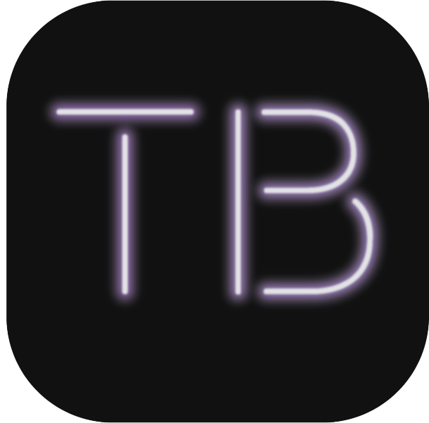
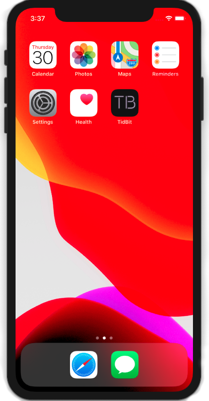
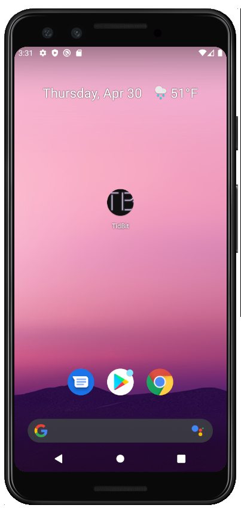
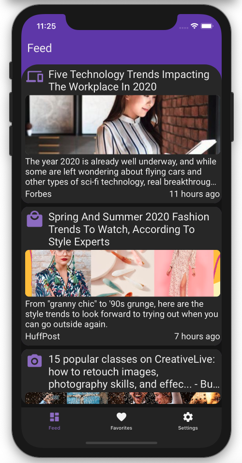
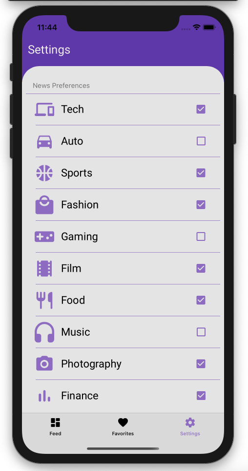
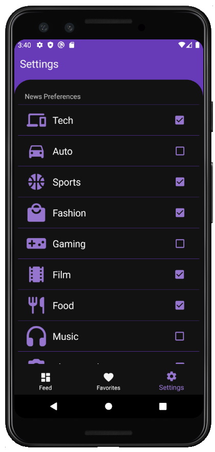

# TidBit    
A cross-platform news aggregate Xamarin app that displays daily news articles tailored to your preferences.

## The Gist
With an overwhelming variety of new articles published every day, absorbing information has become overwhelming in its unfiltered state. **TidBit** is a microlearning cross-platform app for iOS and Android made to help take away the overwhelming nature of the internet and filter it into digestible _TidBit_ sized snippets tailored to _you_.

TidBit is a microlearning app that retrieves articles that matter to you. Toggle your interests such as *Technology, Sports, Movies, Fashion, Photography* to recieve brief _'TidBits'_ of information on a daily basis relating to your preferred topics. Tap on the article card to read more. _'Favorite'_ the article to save it for later.

Sleek. Simple. **TidBit.**

# Features
## Cross-Platform 
No matter what device fits your style, TidBit has you covered.

 iOS            |  Android
:-------------------------:|:-------------------------:
  |   

## Light vs. Dark
View articles in style. TidBit adjusts to light and dark mode dynamically on your device.

 Light Mode            |  Dark Mode
:-------------------------:|:-------------------------:
  |   

## _Your_ Articles, _Your_ Way
Select your interests in preferences, and let TidBit find new articles that match your interests.

 iOS            |  Android
:-------------------------:|:-------------------------:
  |   

## Play for Keeps
Save your favorite articles for later, and remove them when you're done.
  
 iOS            |  Android
:-------------------------:|:-------------------------:
  |   

## Discover. Learn. Share the Wealth.
Tap on a card to display articles and learn more. Tap the _share_ icon to share your latest finds with family and friends.
  
 iOS            |  Android
:-------------------------:|:-------------------------:
  |   
