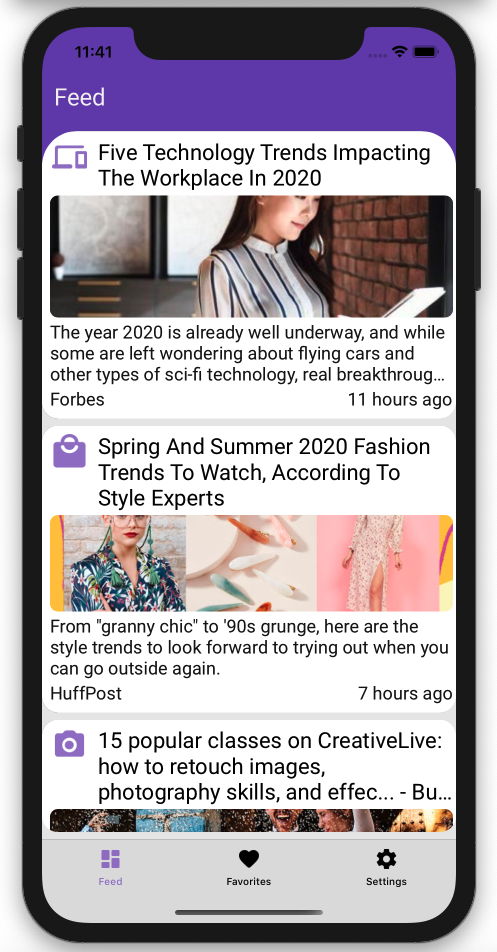
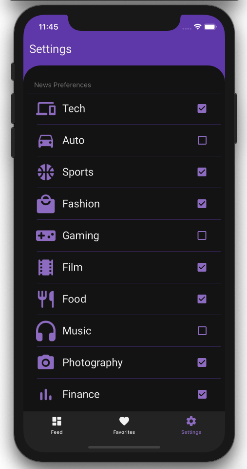

# TidBit
A cross-platform news aggregate Xamarin app that displays daily news articles tailored to your preferences.

With an overwhelming variety of new articles published every day, absorbing information has become rather overwhelming in its unfiltered state. **TidBit** is a microlearning cross-platform app for iOS and Android made to help take away the overwhelming nature of the internet and filter it into digestible **_TidBit_** sized snippets tailored to _you_.

TidBit is a microlearning app that allows users to select categorical preferences that matter to you. Toggle your interests such as *Technology, Sports, Movies, Fashion, Photography* to recieve brief _TidBits_ of information on a daily basis relating to your preferred topics. 

#Features
## Light vs. Dark
View articles in style. TidBit adjusts to light and dark mode dynamically on your device.
           

## _Your_ Articles, _Your_ Way
Select your interests in preferences, and let TidBit find new articles that match your interests.
           

## Play for Keeps
Save your favorite articles for later, and remove them when you're done.
  
